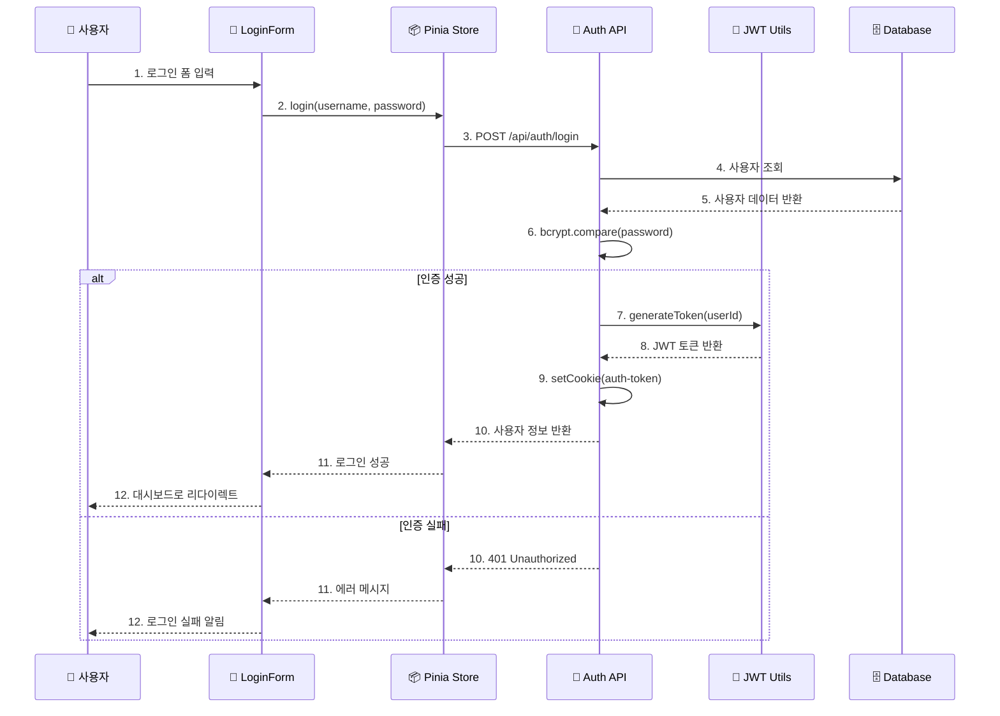
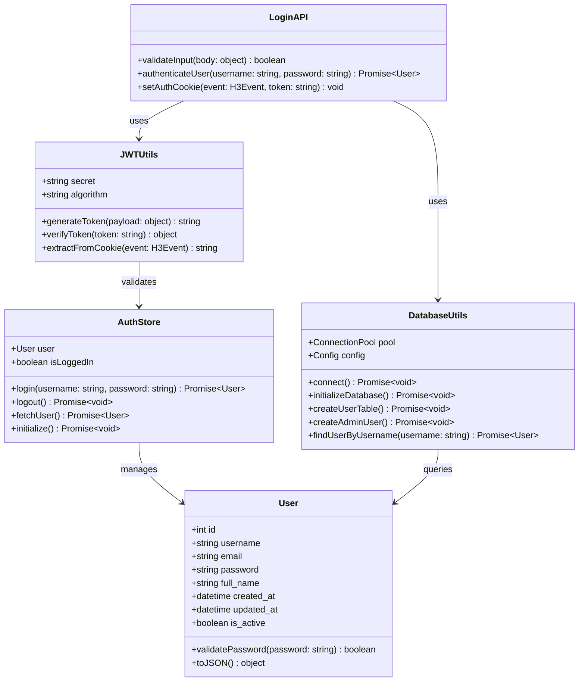
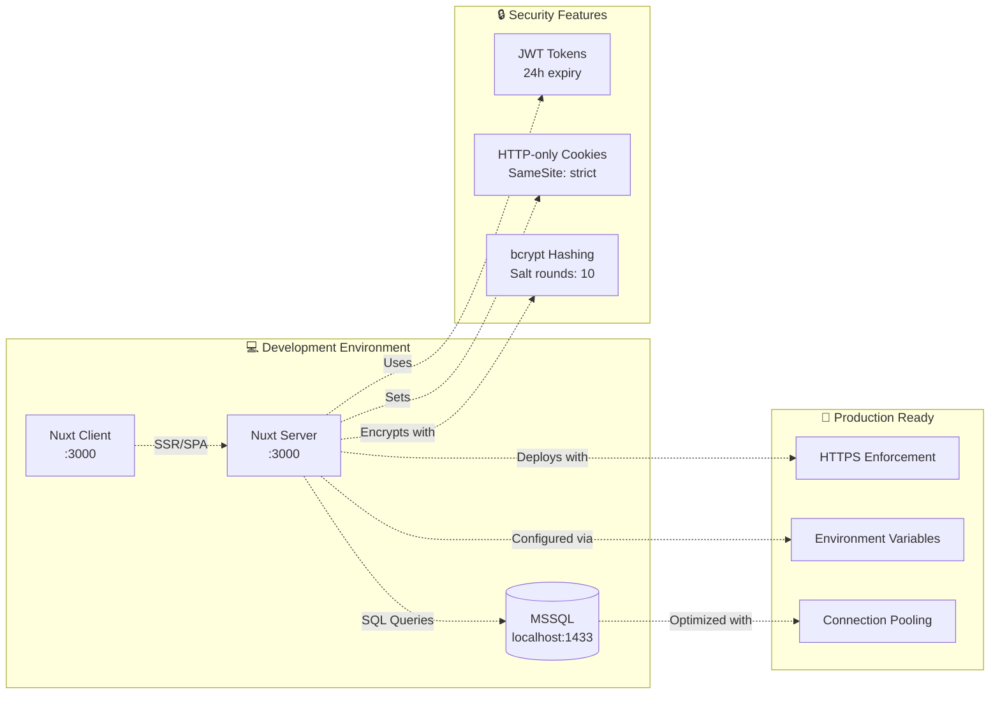

# Nuxt 3 + MSSQL 인증 시스템 구현 가이드

## 📋 개요

이 프로젝트는 **Nuxt 3**, **MSSQL**, **JWT**, **Pinia**를 사용한 완전한 인증 시스템을 구현합니다.

### 🛠 기술 스택
- **Frontend**: Nuxt 3, Vue 3, PrimeVue, Pinia
- **Backend**: Nuxt 3 Server API
- **Database**: Microsoft SQL Server (MSSQL)
- **Authentication**: JWT (JSON Web Token)
- **Password Encryption**: bcryptjs
- **State Management**: Pinia

## 🏗 시스템 아키텍처

### 📊 시스템 컴포넌트 다이어그램

```mermaid
graph TB
    subgraph "🖥️ Client Layer"
        UI[Vue 3 UI Components]
        LoginForm[LoginForm.vue]
        Store[Pinia Auth Store]
        UI --> LoginForm
        UI --> Store
    end
    
    subgraph "🔄 Nuxt 3 Server Layer"
        API[Server API Routes]
        LoginAPI[/api/auth/login]
        LogoutAPI[/api/auth/logout]
        MeAPI[/api/auth/me]
        
        Utils[Server Utils]
        JWT[JWT Utils]
        DB[Database Utils]
        
        Plugins[Server Plugins]
        InitDB[init-db.ts]
        
        API --> LoginAPI
        API --> LogoutAPI
        API --> MeAPI
        Utils --> JWT
        Utils --> DB
        Plugins --> InitDB
    end
    
    subgraph "🗄️ Database Layer"
        MSSQL[(MSSQL Database)]
        Users[app_users Table]
        MSSQL --> Users
    end
    
    %% Connections
    Store -.->|HTTP Requests| API
    LoginAPI -.->|JWT Operations| JWT
    LoginAPI -.->|User Queries| DB
    MeAPI -.->|Token Validation| JWT
    LogoutAPI -.->|Cookie Management| Store
    DB -.->|SQL Queries| MSSQL
    InitDB -.->|Initialize| DB
    
    %% Styling
    classDef clientClass fill:#e1f5fe
    classDef serverClass fill:#f3e5f5
    classDef dbClass fill:#e8f5e8
    
    class UI,LoginForm,Store clientClass
    class API,LoginAPI,LogoutAPI,MeAPI,Utils,JWT,DB,Plugins,InitDB serverClass
    class MSSQL,Users dbClass
```

### 🔄 인증 시퀀스 다이어그램



### 📋 데이터 모델 클래스 다이어그램



### 🌐 배포 다이어그램



## 📁 프로젝트 구조

```
server/
├── api/
│   └── auth/
│       ├── login.post.ts       # 로그인 API
│       ├── logout.post.ts      # 로그아웃 API
│       └── me.get.ts          # 사용자 정보 조회 API
├── utils/
│   ├── db.ts                  # 데이터베이스 연결 및 초기화
│   └── jwt.ts                 # JWT 토큰 생성/검증
└── plugins/
    └── init-db.ts             # 서버 시작시 DB 초기화

stores/
└── auth.ts                    # Pinia 인증 스토어

components/
└── LoginForm.vue              # 로그인 폼 컴포넌트
```

## 🗄 데이터베이스 설정

### 테이블 구조 (`app_users`)

```sql
CREATE TABLE app_users (
    id INT IDENTITY(1,1) PRIMARY KEY,
    username NVARCHAR(50) UNIQUE NOT NULL,
    email NVARCHAR(100) UNIQUE NOT NULL,
    password NVARCHAR(255) NOT NULL,
    full_name NVARCHAR(100),
    created_at DATETIME2 DEFAULT GETDATE(),
    updated_at DATETIME2 DEFAULT GETDATE(),
    is_active BIT DEFAULT 1
)
```

### 기본 관리자 계정
- **사용자명**: `admin`
- **비밀번호**: `admin123`
- **이메일**: `admin@example.com`

## 🔧 구현 세부 사항

### 1. 데이터베이스 연결 (`server/utils/db.ts`)

```typescript
// MSSQL 연결 설정
const config: sql.config = {
  server: 'localhost',
  port: 1433,
  user: 'demo',
  password: 'demo',
  database: 'bbbb',
  options: {
    encrypt: false,
    trustServerCertificate: true
  }
}
```

**주요 기능:**
- 연결 풀링으로 성능 최적화
- 자동 테이블 생성 및 초기 데이터 생성
- bcrypt를 사용한 비밀번호 해싱

### 2. JWT 토큰 관리 (`server/utils/jwt.ts`)

```typescript
// 토큰 생성
const token = jwt.sign(payload, secret, { expiresIn: '24h' })

// 토큰 검증
const decoded = jwt.verify(token, secret)
```

**보안 특징:**
- 24시간 만료 시간
- HTTP-only 쿠키 저장
- 환경변수로 비밀키 관리

### 3. 로그인 API (`server/api/auth/login.post.ts`)

**인증 플로우:**
1. 사용자명/비밀번호 검증
2. 데이터베이스에서 사용자 조회
3. bcrypt로 비밀번호 확인
4. JWT 토큰 생성
5. HTTP-only 쿠키에 토큰 저장
6. 사용자 정보 반환

```typescript
// 비밀번호 검증
const isValidPassword = await bcrypt.compare(password, user.password)

// 쿠키에 토큰 설정
setCookie(event, 'auth-token', token, {
  httpOnly: true,
  secure: process.env.NODE_ENV === 'production',
  sameSite: 'strict',
  maxAge: 60 * 60 * 24 // 24시간
})
```

### 4. 사용자 정보 조회 API (`server/api/auth/me.get.ts`)

**동작 과정:**
1. 쿠키에서 JWT 토큰 추출
2. 토큰 유효성 검증
3. 토큰에서 사용자 정보 추출
4. 사용자 정보 반환

### 5. 로그아웃 API (`server/api/auth/logout.post.ts`)

**로그아웃 처리:**
1. HTTP-only 쿠키 삭제
2. 성공 응답 반환

```typescript
deleteCookie(event, 'auth-token')
```

### 6. Pinia 인증 스토어 (`stores/auth.ts`)

**상태 관리:**
- `user`: 현재 로그인한 사용자 정보
- `isLoggedIn`: 로그인 상태 여부

**주요 액션:**
- `login()`: 로그인 처리
- `logout()`: 로그아웃 처리
- `fetchUser()`: 서버에서 사용자 정보 조회
- `initialize()`: 앱 시작시 인증 상태 확인

```typescript
// 로그인 상태 확인
const isLoggedIn = computed(() => !!user.value)

// 자동 로그인 확인
const initialize = async () => {
  try {
    await fetchUser()
  } catch (error) {
    user.value = null
  }
}
```

## 🔒 보안 기능

### 1. 비밀번호 보안
- **bcryptjs**를 사용한 단방향 해싱
- Salt 라운드 10회 적용
- 원본 비밀번호는 저장되지 않음

### 2. JWT 토큰 보안
- **HTTP-only 쿠키**로 XSS 공격 방지
- **SameSite=strict**로 CSRF 공격 방지
- 24시간 자동 만료
- 프로덕션 환경에서 HTTPS 강제

### 3. API 보안
- 토큰 검증 미들웨어
- 입력값 검증
- 적절한 HTTP 상태 코드 반환

## 🚀 사용 방법

### 1. 로그인

```typescript
// 컴포넌트에서 사용
const authStore = useAuthStore()

const handleLogin = async () => {
  try {
    await authStore.login(username, password)
    // 로그인 성공 처리
  } catch (error) {
    // 에러 처리
  }
}
```

### 2. 로그아웃

```typescript
const handleLogout = async () => {
  await authStore.logout()
  // 로그아웃 후 처리
}
```

### 3. 인증 상태 확인

```typescript
// 컴포넌트에서
const authStore = useAuthStore()
const isLoggedIn = authStore.isLoggedIn
const currentUser = authStore.user
```

### 4. 보호된 페이지

```typescript
// middleware/auth.ts
export default defineNuxtRouteMiddleware((to, from) => {
  const authStore = useAuthStore()
  
  if (!authStore.isLoggedIn) {
    return navigateTo('/login')
  }
})
```

## 🧪 테스트

### 로그인 테스트
1. 브라우저에서 `http://localhost:3002` 접속
2. 테스트 계정으로 로그인: `admin` / `admin123`
3. 개발자 도구에서 쿠키 확인
4. 로그아웃 후 쿠키 삭제 확인

### API 테스트

```bash
# 로그인
curl -X POST http://localhost:3002/api/auth/login \
  -H "Content-Type: application/json" \
  -d '{"username": "admin", "password": "admin123"}'

# 사용자 정보 조회 (쿠키 포함)
curl -X GET http://localhost:3002/api/auth/me \
  -H "Cookie: auth-token=YOUR_TOKEN"

# 로그아웃
curl -X POST http://localhost:3002/api/auth/logout
```

## 🐛 트러블슈팅

### 1. 데이터베이스 연결 오류
- MSSQL 서버가 실행 중인지 확인
- 연결 정보 (서버, 포트, 사용자명, 비밀번호) 확인
- 방화벽 설정 확인

### 2. JWT 토큰 오류
- `.env` 파일의 `JWT_SECRET` 확인
- 토큰 만료 시간 확인
- 쿠키 설정 확인

### 3. 비밀번호 인증 실패
- bcrypt 해싱 확인
- 데이터베이스의 비밀번호 필드 확인

## 📈 향후 개선 사항

1. **Refresh Token 구현**
   - Access Token + Refresh Token 패턴
   - 자동 토큰 갱신

2. **역할 기반 접근 제어 (RBAC)**
   - 사용자 역할 테이블 추가
   - 권한별 라우팅 보호

3. **소셜 로그인**
   - Google, GitHub 등 OAuth 연동

4. **이중 인증 (2FA)**
   - TOTP, SMS 인증 추가

5. **로그인 시도 제한**
   - Rate limiting 구현
   - 계정 잠금 기능

## 📚 참고 자료

- [Nuxt 3 Documentation](https://nuxt.com/)
- [JWT.io](https://jwt.io/)
- [bcryptjs](https://github.com/dcodeIO/bcrypt.js)
- [Pinia Documentation](https://pinia.vuejs.org/)
- [MSSQL Node.js Driver](https://github.com/tediousjs/node-mssql)

---

## 📞 지원

문제가 발생하거나 개선 사항이 있다면 이슈를 등록해 주세요.

**구현 완료 날짜**: 2024년
**버전**: 1.0.0 