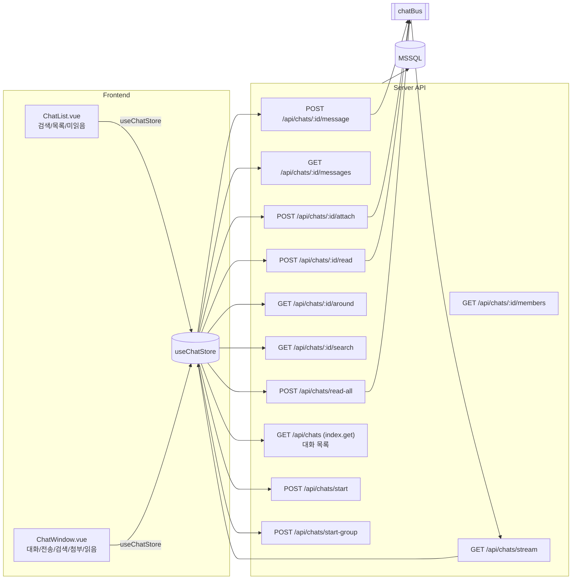
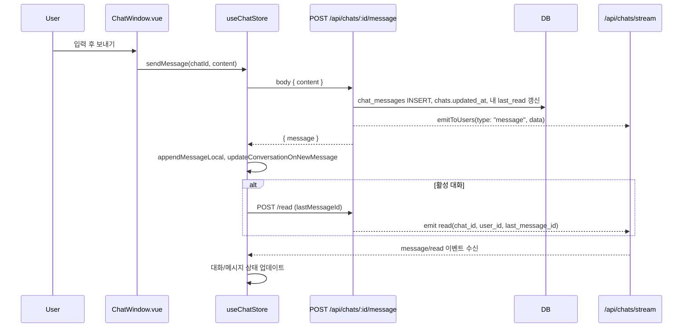
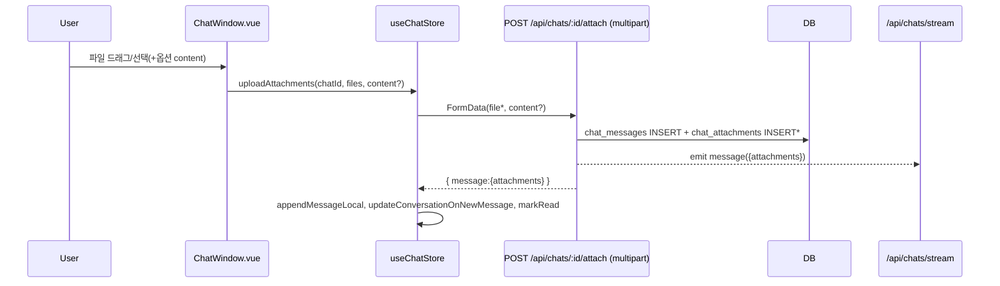
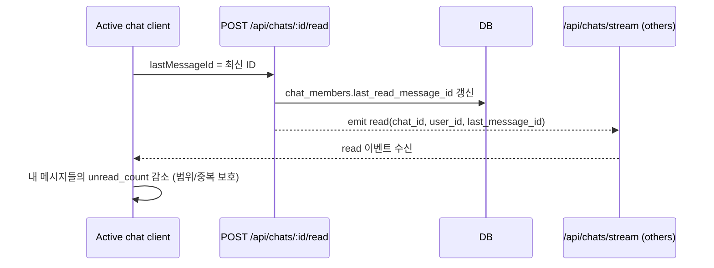
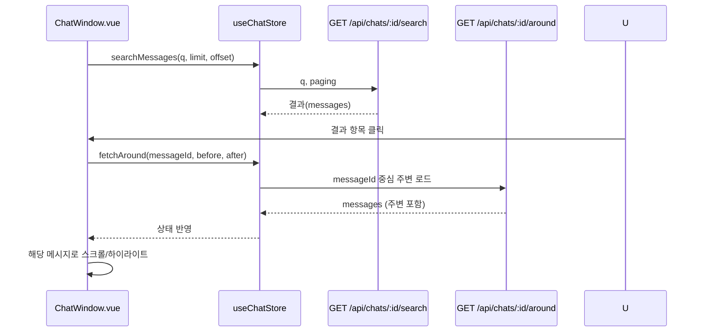
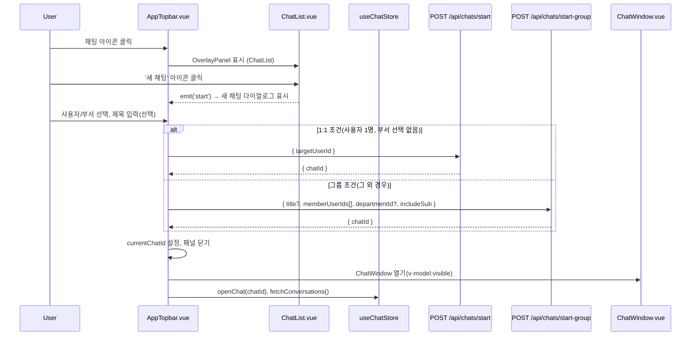

# Chat System Overview

본 문서는 프로젝트의 채팅 기능 전반을 설명합니다. 구성 요소, 데이터 흐름, 실시간 동기화, 읽음 처리, 검색/첨부 동작을 포함합니다.

- 프론트엔드
  - 컴포넌트: `app/components/chat/ChatList.vue`, `app/components/chat/ChatWindow.vue`
  - 스토어: `app/stores/chat.ts` (`useChatStore`)
- 백엔드 API: `server/api/chats/*`
  - 목록: `index.get.ts`
  - 메시지: `id/messages.get.ts`, `id/message.post.ts`, `id/attach.post.ts`, `id/around.get.ts`, `id/search.get.ts`
  - 읽음: `id/read.post.ts`, `read-all.post.ts`
  - 시작: `start.post.ts`(1:1), `start-group.post.ts`(그룹), `id/members.get.ts`
  - 실시간: `stream.get.ts` (SSE)

## Architecture

## Data Model (요약)
실제 스키마는 쿼리에서 유추됩니다.
- `chats`: `id`, `is_group`, `title`, `updated_at`
- `chat_members`: `chat_id`, `user_id`, `last_read_message_id`, `last_read_at`
- `chat_messages`: `id`, `chat_id`, `sender_id`, `content`, `created_at`
- `chat_attachments`: `id`, `message_id`, `file_name`, `file_path`, `mime_type`, `size`
- `app_users`: `id`, `username`, `full_name`, `is_active`, `department_id`

관계: 하나의 `chat` ↔ 다수 `chat_members`/`chat_messages`; 각 메시지 ↔ 다수 `chat_attachments`.

## Frontend Behavior
- `ChatList.vue`
  - 초기에 `startSSE()` + `startPolling(30000)` + `fetchConversations()`.
  - 상단 '모두 읽음'은 `chat.markReadAll()` → 목록 갱신.
  - 항목 클릭 시 상위로 `emit('open', id)`.
  - 상단 우측 '새 채팅' 아이콘 클릭 시 `emit('start')` → 헤더 `AppTopbar.vue`에서 `showStartChat` 다이얼로그를 열고 패널을 닫음.
- `ChatWindow.vue`
  - 열릴 때: `chat.setActiveChat(id)` → `fetchMessages(id)` → `markRead(id)` → 스크롤 하단.
  - 전송: `send()` → 첨부 있으면 `uploadAttachments`, 아니면 `sendMessage`.
  - 첨부 미리보기: 이미지 썸네일, 파일 카드 다운로드 링크.
  - 검색: 입력 → `/api/chats/{id}/search` → 결과 클릭 시 `openResult()`가 `/around` 호출로 해당 메시지 주변 로드 후 해당 메시지로 스크롤/하이라이트.
  - 읽음 처리: 메시지 변화 감시 시 활성 대화면 `markRead(id)` 호출.
  - 스크롤 상태 추적: 하단 여부에 따라 자동 스크롤/신규 메시지 표시 배지.
  - 멤버 보기(그룹): `[id]/members` 다이얼로그.
- `useChatStore`
  - API 래핑: `fetchConversations`, `fetchMessages`, `searchMessages`, `fetchAround`, `sendMessage`, `uploadAttachments`, `markRead`, `markReadAll` 등.
  - SSE: `/api/chats/stream` 수신 → `handleSSE()`에서 `message`, `read` 이벤트 반영. 폴백 폴링 제공.
  - 읽음 감소 로직: `lastReadByUser` 메모리 맵으로 동일 범위 중복 감소 방지.

## Sequence: Send Text Message

## Sequence: Upload Attachments

## Sequence: Read Receipts

## Sequence: Search and Jump

## Sequence: Start Chat (1:1 & Group)

## Operational Notes
- SSE 연결 실패 시 폴링(`startPolling`) 자동 전환, 성공 시 `stopPolling`.
- 타임스탬프 포맷: 클라이언트에서 `formatYMDHMSLocal` 및 서버 SQL `CONVERT(varchar(19), created_at, 120)` 혼용.
- 이미지 판별: `ChatAttachment.mime_type`로 `image/` prefix 체크.
- 보안/권한: 각 API는 `chat_members` 포함 여부 확인 후 수행.
