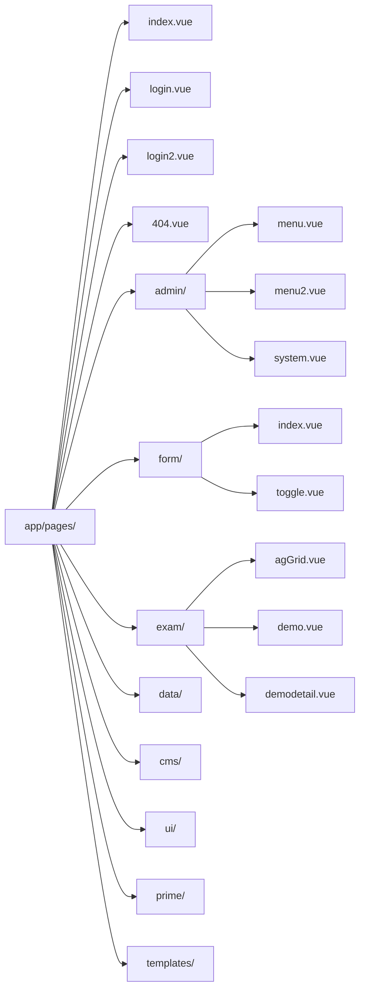
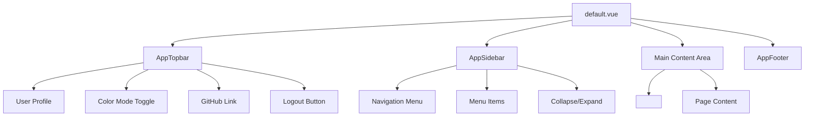
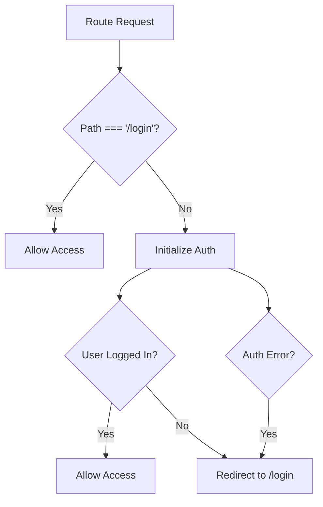
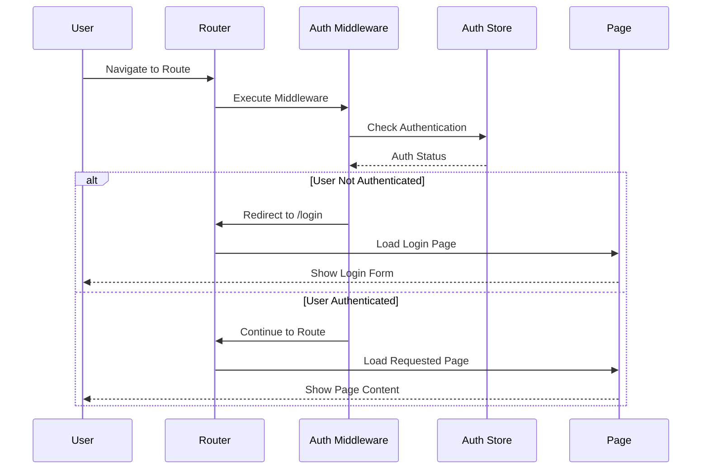

# 🚀 Nuxt3 PrimeVue Starter - 라우팅 설정 가이드

## 📋 목차

- [프로젝트 개요](#프로젝트-개요)
- [라우팅 구조](#라우팅-구조)
- [페이지 디렉토리 구조](#페이지-디렉토리-구조)
- [레이아웃 시스템](#레이아웃-시스템)
- [미들웨어 설정](#미들웨어-설정)
- [라우팅 플로우](#라우팅-플로우)
- [페이지별 상세 설명](#페이지별-상세-설명)
- [라우팅 설정 방법](#라우팅-설정-방법)

## 🎯 프로젝트 개요

이 프로젝트는 **Nuxt 3.17.4**를 기반으로 하며, **PrimeVue**, **FormKit**, **Pinia** 등을 통합한 풀스택 웹 애플리케이션입니다.

### 🔧 주요 기술 스택

- **Frontend**: Nuxt 3, Vue 3, PrimeVue, FormKit
- **State Management**: Pinia
- **Styling**: UnoCSS, SCSS
- **Authentication**: Custom Auth Store
- **Database**: SQLite (Turso)

## 🗺️ 라우팅 구조

```mermaid
graph TD
    A[app.vue] --> B[NuxtLayout]
    B --> C[NuxtPage]
    C --> D{Auth Middleware}
    D -->|Authenticated| E[Protected Pages]
    D -->|Not Authenticated| F[/login]

    E --> G[/ - Dashboard]
    E --> H[/admin/* - Admin Pages]
    E --> I[/form/* - Form Pages]
    E --> J[/exam/* - Exam Pages]
    E --> K[/data/* - Data Pages]
    E --> L[/cms/* - CMS Pages]
    E --> M[/ui/* - UI Components]
    E --> N[/prime/* - PrimeVue Demo]
    E --> O[/templates/* - Templates]

    F --> P[login.vue]
    F --> Q[login2.vue]
```

## 📁 페이지 디렉토리 구조



### 📊 라우팅 테이블

| 경로               | 파일                  | 설명                | 인증 필요 |
| ------------------ | --------------------- | ------------------- | --------- |
| `/`                | `index.vue`           | 메인 대시보드       | ✅        |
| `/login`           | `login.vue`           | 로그인 페이지 (기본) | ❌        |
| `/login2`          | `login2.vue`          | 로그인 페이지 (대안) | ❌        |
| `/admin/menu`      | `admin/menu.vue`      | 관리자 메뉴 관리    | ✅        |
| `/admin/menu2`     | `admin/menu2.vue`     | 고급 메뉴 관리      | ✅        |
| `/admin/system`    | `admin/system.vue`    | 시스템 설정         | ✅        |
| `/form`            | `form/index.vue`      | 폼 데모 메인        | ✅        |
| `/form/toggle`     | `form/toggle.vue`     | 토글 폼 데모        | ✅        |
| `/exam/agGrid`     | `exam/agGrid.vue`     | AG Grid 데모        | ✅        |
| `/exam/demo`       | `exam/demo.vue`       | FormKit 데모        | ✅        |
| `/exam/demodetail` | `exam/demodetail.vue` | 데모 상세 페이지    | ✅        |

## 🎨 레이아웃 시스템



### 📝 레이아웃 구성 요소

- **AppTopbar**: 상단 네비게이션 바

  - 사용자 프로필 드롭다운
  - 다크/라이트 모드 토글
  - GitHub 링크
  - 로그아웃 버튼

- **AppSidebar**: 사이드 네비게이션

  - 메뉴 항목들
  - 접기/펼치기 기능
  - 반응형 디자인

- **AppFooter**: 하단 푸터

## 🔐 미들웨어 설정

### Auth Middleware



#### 🔧 인증 로직

```typescript
// app/middleware/auth.ts
export default defineNuxtRouteMiddleware(async (to, from) => {
  const authStore = useAuthStore()

  // 로그인 페이지는 인증 불필요
  if (to.path === '/login') {
    return
  }

  try {
    await authStore.initAuth()

    if (!authStore.isLoggedIn) {
      return navigateTo('/login')
    }
  }
  catch (error) {
    return navigateTo('/login')
  }
})
```

## 🌊 라우팅 플로우



## 📄 페이지별 상세 설명

### 🏠 메인 페이지 (`/`)

- **파일**: `app/pages/index.vue`
- **기능**: 대시보드 메인 페이지
- **특징**: 인증 필요, 메인 레이아웃 사용

### 🔑 로그인 페이지

#### Primary Login (`/login`)

- **파일**: `app/pages/login.vue`
- **기능**: 기본 로그인 인터페이스
- **특징**: 인증 불필요, 심플한 로그인 폼

#### Alternative Login (`/login2`)

- **파일**: `app/pages/login2.vue`
- **기능**: 대안 로그인 인터페이스
- **특징**: 인증 불필요, 향상된 UI/UX

### 🛠️ 관리자 페이지 (`/admin/*`)

관리자 페이지는 다음과 같은 구조를 가집니다:

- `/admin/menu` - 기본 메뉴 관리
- `/admin/menu2` - 고급 메뉴 관리
- `/admin/system` - 시스템 설정

### 📝 폼 페이지 (`/form/*`)

폼 관련 데모 페이지들:

- `/form/index` - FormKit 기본 데모
- `/form/toggle` - 토글 컴포넌트 데모

### 🧪 실험 페이지 (`/exam/*`)

실험적 기능들을 테스트하는 페이지들:

- `/exam/agGrid` - AG Grid 데모
- `/exam/demo` - FormKit 고급 데모
- `/exam/demodetail` - 데모 상세 페이지

## ⚙️ 라우팅 설정 방법

### 1. 새 페이지 추가

```vue
<!-- app/pages/새경로/새페이지.vue -->
<script setup>
// 페이지 메타데이터 설정
definePageMeta({
  title: '새 페이지',
  description: '새 페이지 설명'
})
</script>

<template>
  <div>
    <h1>새 페이지</h1>
  </div>
</template>
```

### 2. 중첩 라우팅

```
app/pages/
├── parent/
│   ├── index.vue          # /parent
│   ├── child.vue          # /parent/child
│   └── [id]/
│       └── index.vue      # /parent/[id]
```

### 3. 동적 라우팅

```vue
<!-- app/pages/user/[id].vue -->
<script setup>
const route = useRoute()
const userId = route.params.id
</script>
```

### 4. 페이지 미들웨어 적용

```vue
<!-- app/pages/protected.vue -->
<script setup>
definePageMeta({
  middleware: 'auth' // 인증 미들웨어 적용
})
</script>
```

## 🔧 Nuxt.config.ts 라우팅 설정

```typescript
export default defineNuxtConfig({
  // 앱 디렉토리 설정
  srcDir: 'app/',

  // 라우팅 설정
  router: {
    options: {
      // 라우터 옵션
    }
  },

  // 모듈들
  modules: [
    '@pinia/nuxt',
    '@nuxt/content',
    // ... 기타 모듈들
  ],

  // SSR 설정
  ssr: true,

  // 호환성 버전
  future: {
    compatibilityVersion: 4,
  }
})
```

## 🚨 트러블슈팅

### 1. 페이지가 NuxtPage를 사용하지 않는다는 경고

```bash
WARN [nuxt] Your project has pages but the <NuxtPage /> component has not been used.
```

**해결책**: `app.vue`에서 `<NuxtPage />`를 올바르게 사용하고 있는지 확인

### 2. 컴포넌트 중복 등록 경고

```bash
WARN [Vue warn]: Component "Button" has already been registered in target app.
```

**해결책**: PrimeVue 자동 가져오기 설정 확인

### 3. 라우터 경고

```bash
WARN [Vue Router warn]: No match found for location with path "/.well-known/..."
```

**해결책**: 개발자 도구 관련 경고로 무시해도 됨

## 📊 성능 최적화

### 1. 지연 로딩

```typescript
// 컴포넌트 지연 로딩
const LazyComponent = defineAsyncComponent(() => import('~/components/Heavy.vue'))
```

### 2. 페이지 분할

```typescript
// 라우트별 코드 분할 자동 적용
// Nuxt가 각 페이지를 별도 청크로 분할
```

### 3. 미들웨어 최적화

```typescript
// 불필요한 미들웨어 실행 방지
if (import.meta.server && !authStore.initialized) {
  await authStore.initAuth()
}
```

## 🎯 Best Practices

1. **파일 명명**: 케밥 케이스 사용 (`user-profile.vue`)
2. **폴더 구조**: 기능별 그룹화
3. **미들웨어**: 최소한의 로직으로 유지
4. **메타데이터**: 각 페이지에 적절한 메타 설정
5. **에러 처리**: 404 페이지 및 에러 바운더리 구현

---

## 📞 문의 및 지원

라우팅 설정에 대한 추가 질문이나 문제가 있으시면 프로젝트 팀에 문의해주세요.

**작성일**: 2024년 12월
**버전**: Nuxt 3.17.4
**문서 버전**: 1.0.0 