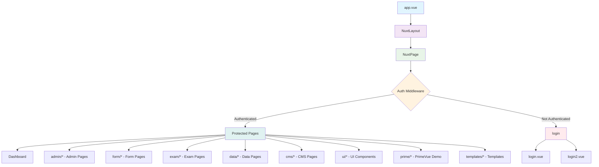
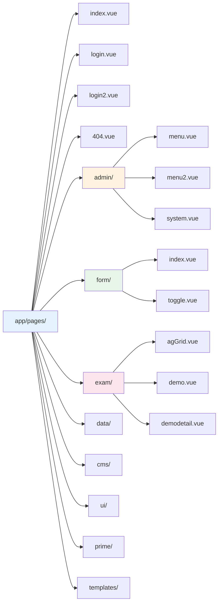
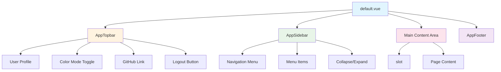
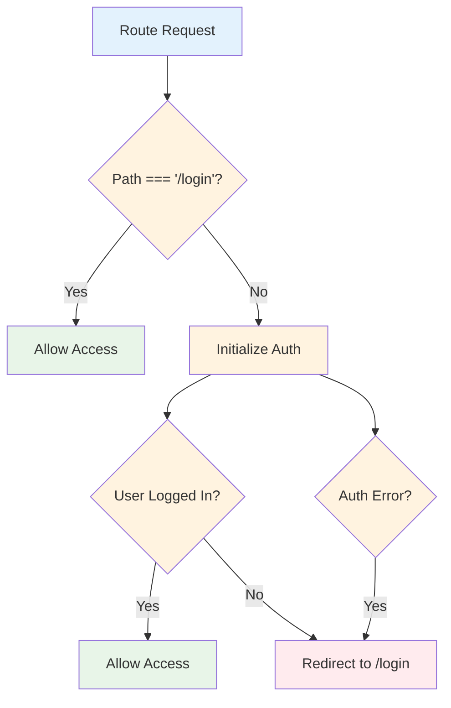

# 🚀 Nuxt3 PrimeVue Starter - 라우팅 설정 가이드

## 📋 목차

- [프로젝트 개요](#프로젝트-개요)
- [라우팅 구조](#라우팅-구조)
- [페이지 디렉토리 구조](#페이지-디렉토리-구조)
- [레이아웃 시스템](#레이아웃-시스템)
- [미들웨어 설정](#미들웨어-설정)
- [라우팅 플로우](#라우팅-플로우)
- [페이지별 상세 설명](#페이지별-상세-설명)
- [라우팅 설정 방법](#라우팅-설정-방법)

## 🎯 프로젝트 개요

이 프로젝트는 **Nuxt 3.17.5**를 기반으로 하며, **PrimeVue**, **FormKit**, **Pinia** 등을 통합한 풀스택 웹 애플리케이션입니다.

### 🔧 주요 기술 스택

- **Frontend**: Nuxt 3, Vue 3, PrimeVue, FormKit
- **State Management**: Pinia
- **Styling**: UnoCSS, SCSS
- **Authentication**: Custom Auth Store
- **Database**: MSSQL

## 🗺️ 라우팅 구조



프로젝트의 라우팅은 다음과 같은 계층 구조를 가집니다:

- **app.vue** → **NuxtLayout** → **NuxtPage**
- **Auth Middleware**를 통한 인증 검사
- 인증된 사용자는 보호된 페이지에 접근
- 미인증 사용자는 로그인 페이지로 리디렉션

### 보호된 페이지들

- `/` - 메인 대시보드
- `/admin/*` - 관리자 페이지들
- `/form/*` - 폼 데모 페이지들
- `/exam/*` - 실험 페이지들
- `/data/*` - 데이터 페이지들
- `/cms/*` - CMS 페이지들
- `/ui/*` - UI 컴포넌트 페이지들
- `/prime/*` - PrimeVue 데모 페이지들
- `/templates/*` - 템플릿 페이지들

### 공개 페이지들

- `/login` - 기본 로그인 페이지
- `/login2` - 대안 로그인 페이지

## 📁 페이지 디렉토리 구조



```
app/pages/
├── index.vue              # 메인 대시보드
├── login.vue              # 기본 로그인
├── login2.vue             # 대안 로그인
├── 404.vue                # 404 에러 페이지
├── admin/                 # 관리자 페이지들
│   ├── menu.vue
│   ├── menu2.vue
│   └── system.vue
├── form/                  # 폼 데모 페이지들
│   ├── index.vue
│   └── toggle.vue
├── exam/                  # 실험 페이지들
│   ├── agGrid.vue
│   ├── demo.vue
│   └── demodetail.vue
├── data/                  # 데이터 페이지들
├── cms/                   # CMS 페이지들
├── ui/                    # UI 컴포넌트 페이지들
├── prime/                 # PrimeVue 데모 페이지들
└── templates/             # 템플릿 페이지들
```

## 📊 라우팅 테이블

| 경로               | 파일                  | 설명                 | 인증 필요 |
| ------------------ | --------------------- | -------------------- | --------- |
| `/`                | `index.vue`           | 메인 대시보드        | ✅        |
| `/login`           | `login.vue`           | 로그인 페이지 (기본) | ❌        |
| `/login2`          | `login2.vue`          | 로그인 페이지 (대안) | ❌        |
| `/admin/menu`      | `admin/menu.vue`      | 관리자 메뉴 관리     | ✅        |
| `/admin/menu2`     | `admin/menu2.vue`     | 고급 메뉴 관리       | ✅        |
| `/admin/system`    | `admin/system.vue`    | 시스템 설정          | ✅        |
| `/form`            | `form/index.vue`      | 폼 데모 메인         | ✅        |
| `/form/toggle`     | `form/toggle.vue`     | 토글 폼 데모         | ✅        |
| `/exam/agGrid`     | `exam/agGrid.vue`     | AG Grid 데모         | ✅        |
| `/exam/demo`       | `exam/demo.vue`       | FormKit 데모         | ✅        |
| `/exam/demodetail` | `exam/demodetail.vue` | 데모 상세 페이지     | ✅        |

| `/uploads/*`       | `server/routes/uploads/[...file].get.ts` | 업로드 파일 서빙 | ❌ |

## 🎨 레이아웃 시스템



### 기본 레이아웃 구조

- **default.vue**: 메인 레이아웃
  - **AppTopbar**: 상단 네비게이션 바
  - **AppSidebar**: 사이드 네비게이션
  - **Main Content Area**: 페이지 컨텐츠 영역
  - **AppFooter**: 하단 푸터

### 레이아웃 구성 요소

#### AppTopbar

- 사용자 프로필 드롭다운
- 다크/라이트 모드 토글
- GitHub 링크
- 로그아웃 버튼

#### AppSidebar

- 네비게이션 메뉴
- 메뉴 항목들
- 접기/펼치기 기능
- 반응형 디자인

#### AppFooter

- 하단 정보 표시

## 🔐 미들웨어 설정

### Auth Middleware



인증 미들웨어는 다음과 같은 플로우로 동작합니다:

1. 라우트 요청 수신
2. 경로가 `/login`인지 확인
3. 로그인 페이지가 아닌 경우 인증 초기화
4. 사용자 로그인 상태 확인
5. 미로그인 시 `/login`으로 리디렉션
6. 로그인 시 요청된 페이지로 이동

#### 인증 로직 코드

```typescript
// app/middleware/auth.ts
export default defineNuxtRouteMiddleware(async (to, from) => {
  const authStore = useAuthStore()

  // 로그인 페이지는 인증 불필요
  if (to.path === '/login') {
    return
  }

  try {
    await authStore.initAuth()

    if (!authStore.isLoggedIn) {
      return navigateTo('/login')
    }
  }
  catch (error) {
    return navigateTo('/login')
  }
})
```

## 🌊 라우팅 플로우


### 인증된 사용자 플로우

1. 사용자가 라우트 요청
2. 라우터가 미들웨어 실행
3. 미들웨어가 인증 상태 확인
4. 인증 성공 시 요청된 페이지 로드
5. 페이지 컨텐츠 표시

### 미인증 사용자 플로우

1. 사용자가 라우트 요청
2. 라우터가 미들웨어 실행
3. 미들웨어가 인증 상태 확인
4. 인증 실패 시 `/login`으로 리디렉션
5. 로그인 폼 표시

## 📄 페이지별 상세 설명

### 🏠 메인 페이지 (`/`)

- **파일**: `app/pages/index.vue`
- **기능**: 대시보드 메인 페이지
- **특징**: 인증 필요, 메인 레이아웃 사용
- **내용**: 프로젝트 소개, 기능 카드들, 사용자 환영 메시지

### 🔑 로그인 페이지

#### Primary Login (`/login`)

- **파일**: `app/pages/login.vue`
- **기능**: 기본 로그인 인터페이스
- **특징**: 인증 불필요, 심플한 로그인 폼
- **레이아웃**: 별도 레이아웃 사용

#### Alternative Login (`/login2`)

- **파일**: `app/pages/login2.vue`
- **기능**: 대안 로그인 인터페이스
- **특징**: 인증 불필요, FormKit 기반 향상된 UI/UX
- **레이아웃**: 별도 레이아웃 사용

### 🛠️ 관리자 페이지 (`/admin/*`)

```mermaid
graph LR
    A[admin] --> B[admin/menu<br/>기본 메뉴 관리]
    A --> C[admin/menu2<br/>고급 메뉴 관리]
    A --> D[admin/system<br/>시스템 설정]

    style A fill:#e3f2fd
    style B fill:#fff3e0
    style C fill:#e8f5e8
    style D fill:#fce4ec
```



관리자 전용 페이지들로 시스템 관리 기능을 제공합니다:

- **`/admin/menu`**: 기본 메뉴 관리 인터페이스
- **`/admin/menu2`**: 고급 메뉴 관리 기능
- **`/admin/system`**: 시스템 설정 및 구성

### 📝 폼 페이지 (`/form/*`)

```mermaid
graph LR
    A[form] --> B[form/index<br/>FormKit 기본 데모]
    A --> C[form/toggle<br/>토글 컴포넌트 데모]

    style A fill:#e3f2fd
    style B fill:#e8f5e8
    style C fill:#fff3e0
```



FormKit을 활용한 폼 데모 페이지들:

- **`/form/index`**: FormKit 기본 데모 및 예제
- **`/form/toggle`**: 토글 컴포넌트 데모

### 🧪 실험 페이지 (`/exam/*`)

```mermaid
graph LR
    A[exam] --> B[exam/agGrid<br/>AG Grid 데모]
    A --> C[exam/demo<br/>FormKit 고급 데모]
    A --> D[exam/demodetail<br/>데모 상세 페이지]

    style A fill:#e3f2fd
    style B fill:#fce4ec
    style C fill:#e8f5e8
    style D fill:#fff3e0
```



실험적 기능들을 테스트하는 페이지들:

- **`/exam/agGrid`**: AG Grid 데이터 테이블 데모
- **`/exam/demo`**: FormKit 고급 기능 데모
- **`/exam/demodetail`**: 데모 상세 페이지

## ⚙️ 라우팅 설정 방법

### 1. 새 페이지 추가

```vue
<!-- app/pages/새경로/새페이지.vue -->
<script setup>
// 페이지 메타데이터 설정
definePageMeta({
  title: '새 페이지',
  description: '새 페이지 설명'
})
</script>

<template>
  <div>
    <h1>새 페이지</h1>
    <p>페이지 내용</p>
  </div>
</template>
```

### 2. 중첩 라우팅

```
app/pages/
├── parent/
│   ├── index.vue          # /parent
│   ├── child.vue          # /parent/child
│   └── [id]/
│       └── index.vue      # /parent/[id]
```

### 3. 동적 라우팅

```vue
<!-- app/pages/user/[id].vue -->
<script setup>
const route = useRoute()
const userId = route.params.id
</script>

<template>
  <div>
    <h1>사용자 ID: {{ userId }}</h1>
  </div>
</template>
```

### 4. 페이지 미들웨어 적용

```vue
<!-- app/pages/protected.vue -->
<script setup>
definePageMeta({
  middleware: 'auth' // 인증 미들웨어 적용
})
</script>

<template>
  <div>
    <h1>보호된 페이지</h1>
  </div>
</template>
```

## 🔧 Nuxt.config.ts 라우팅 설정

```typescript
export default defineNuxtConfig({
  // 앱 디렉토리 설정
  srcDir: 'app/',

  // 라우팅 설정
  router: {
    options: {
      // 라우터 옵션
    }
  },

  // 모듈들
  modules: [
    '@pinia/nuxt',
    '@nuxt/content',
    '@vueuse/nuxt',
    '@nuxt/test-utils/module',
    '@nuxt/eslint',
    '@nuxt/image',
    '@nuxt/fonts',
    '@sfxcode/formkit-primevue-nuxt',
    '@unocss/nuxt',
    '@pinia/colada-nuxt',
  ],

  // SSR 설정
  ssr: true,

  // Nitro 정적 자산 서빙 (업로드 포함)
  nitro: {
    serveStatic: true,
    publicAssets: [{ dir: 'public', baseURL: '/' }],
  },

  // 호환성 버전
  future: {
    compatibilityVersion: 4,
  }
})
```

## 🚨 트러블슈팅

### 1. 페이지가 NuxtPage를 사용하지 않는다는 경고

```bash
WARN [nuxt] Your project has pages but the <NuxtPage /> component has not been used.
```

**해결책**: `app.vue`에서 `<NuxtPage />`를 올바르게 사용하고 있는지 확인

### 2. 컴포넌트 중복 등록 경고

```bash
WARN [Vue warn]: Component "Button" has already been registered in target app.
```

**해결책**: PrimeVue 자동 가져오기 설정 확인

### 3. 라우터 경고

```bash
WARN [Vue Router warn]: No match found for location with path "/.well-known/..."
```

**해결책**: 개발자 도구 관련 경고로 무시해도 됨

## 📊 성능 최적화

### 1. 지연 로딩

```typescript
// 컴포넌트 지연 로딩
const LazyComponent = defineAsyncComponent(() => import('~/components/Heavy.vue'))
```

### 2. 페이지 분할

Nuxt는 각 페이지를 자동으로 별도 청크로 분할하여 초기 로딩 시간을 최적화합니다.

### 3. 미들웨어 최적화

```typescript
// 불필요한 미들웨어 실행 방지
if (import.meta.server && !authStore.initialized) {
  await authStore.initAuth()
}
```

## 🎯 Best Practices

1. **파일 명명**: 케밥 케이스 사용 (`user-profile.vue`)
2. **폴더 구조**: 기능별 그룹화
3. **미들웨어**: 최소한의 로직으로 유지
4. **메타데이터**: 각 페이지에 적절한 메타 설정
5. **에러 처리**: 404 페이지 및 에러 바운더리 구현
6. **SEO**: 각 페이지에 적절한 title과 description 설정
7. **접근성**: 적절한 ARIA 라벨과 시맨틱 HTML 사용

---

## 📞 문의 및 지원

라우팅 설정에 대한 추가 질문이나 문제가 있으시면 프로젝트 팀에 문의해주세요.

**작성일**: 2024년 12월
**버전**: Nuxt 3.17.4
**문서 버전**: 1.0.0 