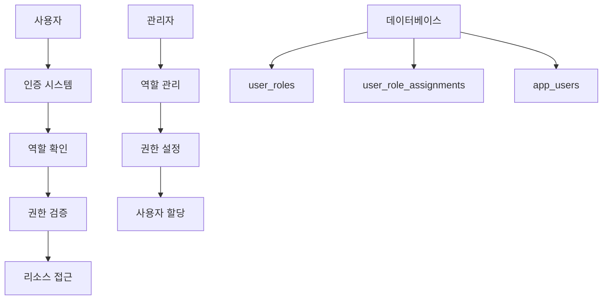

# 🎭 사용자 역할 관리 시스템 구현 가이드

## 📋 개요

SMART MES 시스템에 **사용자 역할 관리 기능**을 추가하는 완전한 구현 가이드입니다. 이 가이드를 통해 역할 기반 접근 제어(RBAC) 시스템을 구축할 수 있습니다.

## 🎯 목표

- 🔐 역할 기반 권한 시스템 구축
- 👥 사용자별 역할 할당 관리
- 🛡️ 페이지 및 기능별 접근 제어
- 🎨 직관적인 관리자 인터페이스 제공

## 📊 시스템 아키텍처



---

## 🗄️ 1단계: 데이터베이스 설계

### 1.1 테이블 구조

#### `user_roles` 테이블 (역할 정의)

```sql
CREATE TABLE user_roles (
    id INT IDENTITY(1,1) PRIMARY KEY,
    role_name NVARCHAR(50) UNIQUE NOT NULL,     -- 역할명 (admin, manager, user)
    role_description NVARCHAR(255),             -- 역할 설명
    permissions NVARCHAR(MAX),                  -- JSON 형태 권한
    is_active BIT DEFAULT 1,                    -- 활성 상태
    created_at DATETIME2 DEFAULT GETDATE(),
    updated_at DATETIME2 DEFAULT GETDATE()
);
```

#### `user_role_assignments` 테이블 (사용자-역할 매핑)

```sql
CREATE TABLE user_role_assignments (
    id INT IDENTITY(1,1) PRIMARY KEY,
    user_id INT NOT NULL,                       -- app_users.id FK
    role_id INT NOT NULL,                       -- user_roles.id FK
    assigned_at DATETIME2 DEFAULT GETDATE(),   -- 할당 일시
    assigned_by INT,                            -- 할당한 관리자 ID
    FOREIGN KEY (user_id) REFERENCES app_users(id),
    FOREIGN KEY (role_id) REFERENCES user_roles(id),
    UNIQUE(user_id, role_id)                    -- 중복 방지
);
```

### 1.2 기본 데이터 설정

#### 기본 역할 생성

```sql
INSERT INTO user_roles (role_name, role_description, permissions) VALUES 
('admin', '시스템 관리자', '{"all": true}'),
('manager', '관리자', '{"users": "read", "menu": "write", "reports": "read"}'),
('editor', '편집자', '{"content": "write", "menu": "read"}'),
('user', '일반 사용자', '{"profile": "write"}');
```

#### 기본 관리자 역할 할당

```sql
INSERT INTO user_role_assignments (user_id, role_id)
SELECT u.id, r.id 
FROM app_users u, user_roles r
WHERE u.username = 'admin' AND r.role_name = 'admin';
```

### 1.3 데이터베이스 초기화 수정

**파일 위치:** `server/utils/db.ts`

`initializeDatabase()` 함수에 다음 코드를 추가:

```typescript
// user_roles 테이블 확인 및 생성
const checkRolesTable = await connection.request().query(`
  SELECT COUNT(*) as count 
  FROM information_schema.tables 
  WHERE table_name = 'user_roles'
`)

if (checkRolesTable.recordset[0].count === 0) {
  await connection.request().query(`
    CREATE TABLE user_roles (
      id INT IDENTITY(1,1) PRIMARY KEY,
      role_name NVARCHAR(50) UNIQUE NOT NULL,
      role_description NVARCHAR(255),
      permissions NVARCHAR(MAX),
      is_active BIT DEFAULT 1,
      created_at DATETIME2 DEFAULT GETDATE(),
      updated_at DATETIME2 DEFAULT GETDATE()
    )
  `)
  
  // 기본 역할 데이터 삽입
  await connection.request().query(`
    INSERT INTO user_roles (role_name, role_description, permissions)
    VALUES 
      ('admin', '시스템 관리자', '{"all": true}'),
      ('manager', '관리자', '{"users": "read", "menu": "write"}'),
      ('editor', '편집자', '{"content": "write"}'),
      ('user', '일반 사용자', '{"profile": "write"}')
  `)
}

// user_role_assignments 테이블 생성 및 기본 할당
// ... (위 SQL 참조)
```

---

## 🖥️ 2단계: 백엔드 API 구축

### 2.1 API 엔드포인트 구조

```
server/api/
├── roles/
│   ├── index.get.ts          # 역할 목록 조회
│   ├── index.post.ts         # 역할 생성
│   ├── [id].get.ts           # 역할 상세 조회
│   ├── [id].put.ts           # 역할 수정
│   └── [id].delete.ts        # 역할 삭제
├── users/
│   └── [userId]/
│       └── roles/
│           ├── index.get.ts  # 사용자 역할 조회
│           ├── index.post.ts # 역할 할당
│           └── [roleId].delete.ts # 역할 해제
└── auth/
    ├── permissions.get.ts    # 현재 사용자 권한 조회
    └── check-permission.post.ts # 권한 검증
```

### 2.2 주요 API 구현 예시

#### 역할 목록 조회 (`server/api/roles/index.get.ts`)

```typescript
import { getDbConnection } from '../../utils/db'

export default defineEventHandler(async (event) => {
  try {
    const connection = await getDbConnection()
    
    const result = await connection.request().query(`
      SELECT 
        id, role_name, role_description, permissions, 
        is_active, created_at, updated_at
      FROM user_roles 
      WHERE is_active = 1
      ORDER BY role_name
    `)
    
    return {
      success: true,
      data: result.recordset.map(role => ({
        ...role,
        permissions: JSON.parse(role.permissions || '{}')
      }))
    }
  } catch (error) {
    throw createError({
      statusCode: 500,
      statusMessage: '역할 목록을 불러오는데 실패했습니다.'
    })
  }
})
```

#### 역할 생성 (`server/api/roles/index.post.ts`)

```typescript
interface CreateRoleData {
  role_name: string
  role_description?: string
  permissions: object
}

export default defineEventHandler(async (event) => {
  try {
    const body = await readBody(event) as CreateRoleData
    const { role_name, role_description, permissions } = body

    if (!role_name) {
      throw createError({
        statusCode: 400,
        statusMessage: '역할명은 필수입니다.'
      })
    }

    const connection = await getDbConnection()
    
    const result = await connection.request()
      .input('role_name', role_name)
      .input('role_description', role_description || '')
      .input('permissions', JSON.stringify(permissions))
      .query(`
        INSERT INTO user_roles (role_name, role_description, permissions)
        OUTPUT INSERTED.id
        VALUES (@role_name, @role_description, @permissions)
      `)

    return {
      success: true,
      message: '역할이 성공적으로 생성되었습니다.',
      data: { id: result.recordset[0].id }
    }
  } catch (error) {
    throw createError({
      statusCode: 500,
      statusMessage: '역할 생성에 실패했습니다.'
    })
  }
})
```

### 2.3 권한 검증 유틸리티

**파일 위치:** `server/utils/permissions.ts`

```typescript
interface Permission {
  resource: string  // "users", "menu", "content"
  action: string    // "read", "write", "delete"
}

export function hasPermission(userPermissions: any, required: Permission): boolean {
  // 모든 권한이 있는 경우
  if (userPermissions.all) return true
  
  const resource = userPermissions[required.resource]
  if (!resource) return false
  
  // write 권한은 read 권한을 포함
  if (resource === "write" && required.action === "read") return true
  
  return resource === required.action
}

export async function getUserPermissions(userId: number): Promise<any> {
  const connection = await getDbConnection()
  
  const result = await connection.request()
    .input('userId', userId)
    .query(`
      SELECT r.permissions
      FROM user_roles r
      JOIN user_role_assignments ra ON r.id = ra.role_id
      WHERE ra.user_id = @userId AND r.is_active = 1
    `)
  
  // 모든 역할의 권한을 병합
  const allPermissions = {}
  result.recordset.forEach(row => {
    const permissions = JSON.parse(row.permissions || '{}')
    Object.assign(allPermissions, permissions)
  })
  
  return allPermissions
}
```

---

## 🎨 3단계: 프론트엔드 구현

### 3.1 Pinia Store 생성

#### 역할 관리 Store (`app/stores/roles.ts`)

```typescript
interface Role {
  id: number
  role_name: string
  role_description: string
  permissions: Record<string, any>
  is_active: boolean
  created_at: string
  updated_at: string
}

interface CreateRoleData {
  role_name: string
  role_description?: string
  permissions: Record<string, any>
}

export const useRolesStore = defineStore('roles', () => {
  const roles = ref<Role[]>([])
  const loading = ref(false)
  const error = ref<string | null>(null)

  // 역할 목록 조회
  const fetchRoles = async () => {
    loading.value = true
    error.value = null
    
    try {
      const response = await $fetch<{success: boolean, data: Role[]}>('/api/roles')
      if (response.success) {
        roles.value = response.data
      }
    } catch (err: any) {
      error.value = err.data?.message || '역할 목록 조회에 실패했습니다.'
      console.error('역할 조회 오류:', err)
    } finally {
      loading.value = false
    }
  }

  // 역할 생성
  const createRole = async (roleData: CreateRoleData) => {
    loading.value = true
    error.value = null

    try {
      const response = await $fetch('/api/roles', {
        method: 'POST',
        body: roleData
      })

      if (response.success) {
        await fetchRoles() // 목록 새로고침
        return { success: true }
      }
    } catch (err: any) {
      error.value = err.data?.message || '역할 생성에 실패했습니다.'
      return { success: false, error: error.value }
    } finally {
      loading.value = false
    }
  }

  // 역할 수정
  const updateRole = async (id: number, roleData: Partial<CreateRoleData>) => {
    loading.value = true
    error.value = null

    try {
      const response = await $fetch(`/api/roles/${id}`, {
        method: 'PUT',
        body: roleData
      })

      if (response.success) {
        await fetchRoles() // 목록 새로고침
        return { success: true }
      }
    } catch (err: any) {
      error.value = err.data?.message || '역할 수정에 실패했습니다.'
      return { success: false, error: error.value }
    } finally {
      loading.value = false
    }
  }

  // 역할 삭제
  const deleteRole = async (id: number) => {
    loading.value = true
    error.value = null

    try {
      const response = await $fetch(`/api/roles/${id}`, {
        method: 'DELETE'
      })

      if (response.success) {
        await fetchRoles() // 목록 새로고침
        return { success: true }
      }
    } catch (err: any) {
      error.value = err.data?.message || '역할 삭제에 실패했습니다.'
      return { success: false, error: error.value }
    } finally {
      loading.value = false
    }
  }

  return {
    roles,
    loading,
    error,
    fetchRoles,
    createRole,
    updateRole,
    deleteRole
  }
})
```

#### 인증 Store 확장 (`app/stores/auth.ts`)

기존 `useAuthStore`에 권한 관련 기능 추가:

```typescript
// 기존 코드에 추가
const permissions = ref<any>({})
const userRoles = ref<Role[]>([])

// 사용자 권한 조회
const fetchUserPermissions = async () => {
  try {
    const response = await $fetch('/api/auth/permissions')
    permissions.value = response.permissions
    userRoles.value = response.roles
  } catch (error) {
    console.error('권한 조회 실패:', error)
    permissions.value = {}
    userRoles.value = []
  }
}

// 권한 확인
const hasPermission = (resource: string, action: string = 'read'): boolean => {
  if (permissions.value.all) return true
  
  const resourcePermission = permissions.value[resource]
  if (!resourcePermission) return false
  
  if (resourcePermission === 'write' && action === 'read') return true
  return resourcePermission === action
}

// 역할 확인
const hasRole = (roleName: string): boolean => {
  return userRoles.value.some(role => role.role_name === roleName)
}

// initAuth 함수 수정 (권한도 함께 로드)
const initAuth = async () => {
  if (user.value) {
    await fetchUserPermissions()
    return true
  }
  
  try {
    const data = await $fetch<AuthResponse>('/api/auth/me')
    if (data && data.user) {
      user.value = data.user
      await fetchUserPermissions()
      return true
    }
    return false
  } catch (error) {
    user.value = null
    permissions.value = {}
    return false
  }
}

// return에 추가
return {
  // ... 기존 항목들
  permissions,
  userRoles,
  fetchUserPermissions,
  hasPermission,
  hasRole
}
```

### 3.2 페이지 구현

#### 역할 목록 페이지 (`app/pages/admin/roles/index.vue`)

```vue
<template>
  <div class="p-6">
    <!-- 헤더 섹션 -->
    <div class="mb-6">
      <h1 class="text-3xl font-bold text-gray-900 mb-2">역할 관리</h1>
      <p class="text-gray-600">사용자 역할과 권한을 관리합니다.</p>
    </div>

    <!-- 액션 버튼 -->
    <div class="mb-4 flex gap-2">
      <Button 
        icon="pi pi-plus" 
        label="새 역할 추가" 
        @click="showCreateDialog = true"
        class="p-button-success"
      />
      <Button 
        icon="pi pi-refresh" 
        label="새로고침" 
        @click="rolesStore.fetchRoles()"
        :loading="rolesStore.loading"
      />
    </div>

    <!-- 역할 목록 테이블 -->
    <Card>
      <template #content>
        <DataTable 
          :value="rolesStore.roles" 
          :loading="rolesStore.loading"
          paginator 
          :rows="10"
          dataKey="id"
          class="p-datatable-sm"
        >
          <Column field="role_name" header="역할명" sortable>
            <template #body="{ data }">
              <Tag 
                :value="data.role_name" 
                :class="getRoleTagClass(data.role_name)"
              />
            </template>
          </Column>
          
          <Column field="role_description" header="설명" />
          
          <Column header="권한" style="width: 200px">
            <template #body="{ data }">
              <div class="flex gap-1 flex-wrap">
                <Chip 
                  v-for="(value, key) in data.permissions" 
                  :key="key"
                  :label="`${key}: ${value}`"
                  class="text-xs"
                />
              </div>
            </template>
          </Column>
          
          <Column field="created_at" header="생성일" sortable>
            <template #body="{ data }">
              {{ formatDate(data.created_at) }}
            </template>
          </Column>
          
          <Column header="액션" style="width: 120px">
            <template #body="{ data }">
              <div class="flex gap-1">
                <Button 
                  icon="pi pi-pencil" 
                  size="small"
                  class="p-button-text p-button-info"
                  @click="editRole(data)"
                  v-tooltip="'편집'"
                />
                <Button 
                  icon="pi pi-trash" 
                  size="small"
                  class="p-button-text p-button-danger"
                  @click="confirmDeleteRole(data)"
                  v-tooltip="'삭제'"
                  :disabled="data.role_name === 'admin'"
                />
              </div>
            </template>
          </Column>
        </DataTable>
      </template>
    </Card>

    <!-- 역할 생성/편집 다이얼로그 -->
    <RoleFormDialog 
      v-model:visible="showCreateDialog"
      :role="selectedRole"
      @saved="onRoleSaved"
    />

    <!-- 삭제 확인 다이얼로그 -->
    <ConfirmDialog />
  </div>
</template>

<script setup lang="ts">
definePageMeta({
  middleware: ['auth'],
  layout: 'default'
})

const rolesStore = useRolesStore()
const { confirm } = useConfirm()
const toast = useToast()

// 반응형 데이터
const showCreateDialog = ref(false)
const selectedRole = ref(null)

// 컴포넌트 마운트 시 데이터 로드
onMounted(() => {
  rolesStore.fetchRoles()
})

// 역할 편집
const editRole = (role: any) => {
  selectedRole.value = { ...role }
  showCreateDialog.value = true
}

// 역할 삭제 확인
const confirmDeleteRole = (role: any) => {
  confirm.require({
    message: `"${role.role_name}" 역할을 삭제하시겠습니까?\n이 작업은 되돌릴 수 없습니다.`,
    header: '역할 삭제 확인',
    icon: 'pi pi-exclamation-triangle',
    acceptClass: 'p-button-danger',
    accept: () => deleteRole(role)
  })
}

// 역할 삭제 실행
const deleteRole = async (role: any) => {
  const result = await rolesStore.deleteRole(role.id)
  
  if (result.success) {
    toast.add({
      severity: 'success',
      summary: '성공',
      detail: '역할이 삭제되었습니다.',
      life: 3000
    })
  } else {
    toast.add({
      severity: 'error',
      summary: '오류',
      detail: result.error || '역할 삭제에 실패했습니다.',
      life: 3000
    })
  }
}

// 역할 저장 완료 처리
const onRoleSaved = () => {
  showCreateDialog.value = false
  selectedRole.value = null
  
  toast.add({
    severity: 'success',
    summary: '성공',
    detail: '역할이 저장되었습니다.',
    life: 3000
  })
}

// 유틸리티 함수들
const getRoleTagClass = (roleName: string) => {
  const classes = {
    admin: 'p-tag-danger',
    manager: 'p-tag-warning', 
    editor: 'p-tag-info',
    user: 'p-tag-success'
  }
  return classes[roleName] || 'p-tag-secondary'
}

const formatDate = (dateString: string) => {
  return new Date(dateString).toLocaleDateString('ko-KR')
}
</script>
```

### 3.3 컴포넌트 구현

#### 권한 가드 컴포넌트 (`app/components/common/PermissionGuard.vue`)

```vue
<template>
  <div v-if="hasAccess">
    <slot />
  </div>
  <div v-else-if="showFallback">
    <slot name="fallback">
      <div class="text-gray-500 text-center p-4">
        <i class="pi pi-lock text-2xl mb-2"></i>
        <p>이 기능에 접근할 권한이 없습니다.</p>
      </div>
    </slot>
  </div>
</template>

<script setup lang="ts">
interface Props {
  resource: string
  action?: string
  role?: string
  showFallback?: boolean
}

const props = withDefaults(defineProps<Props>(), {
  action: 'read',
  showFallback: false
})

const authStore = useAuthStore()

const hasAccess = computed(() => {
  // 역할 기반 체크
  if (props.role) {
    return authStore.hasRole(props.role)
  }
  
  // 권한 기반 체크
  return authStore.hasPermission(props.resource, props.action)
})
</script>
```

#### 역할 폼 다이얼로그 (`app/components/roles/RoleFormDialog.vue`)

```vue
<template>
  <Dialog 
    v-model:visible="dialogVisible" 
    :header="isEditing ? '역할 편집' : '새 역할 추가'"
    :style="{ width: '600px' }"
    modal
  >
    <form @submit.prevent="handleSubmit">
      <div class="grid grid-cols-1 gap-4">
        <!-- 역할명 -->
        <div>
          <label class="block text-sm font-medium mb-1">역할명 *</label>
          <InputText 
            v-model="formData.role_name"
            :class="{ 'p-invalid': errors.role_name }"
            placeholder="예: manager, editor"
          />
          <small v-if="errors.role_name" class="p-error">{{ errors.role_name }}</small>
        </div>

        <!-- 설명 -->
        <div>
          <label class="block text-sm font-medium mb-1">설명</label>
          <Textarea 
            v-model="formData.role_description"
            rows="3"
            placeholder="역할에 대한 설명을 입력하세요"
          />
        </div>

        <!-- 권한 매트릭스 -->
        <div>
          <label class="block text-sm font-medium mb-2">권한 설정</label>
          <div class="border rounded p-4">
            <div class="grid grid-cols-4 gap-2 text-sm font-medium mb-2">
              <div>리소스</div>
              <div class="text-center">읽기</div>
              <div class="text-center">쓰기</div>
              <div class="text-center">삭제</div>
            </div>
            
            <div v-for="resource in availableResources" :key="resource.key" class="grid grid-cols-4 gap-2 items-center py-2 border-t">
              <div class="font-medium">{{ resource.label }}</div>
              <div class="text-center">
                <Checkbox 
                  v-model="permissions[resource.key]"
                  :binary="true"
                  :true-value="'read'"
                  :false-value="null"
                />
              </div>
              <div class="text-center">
                <Checkbox 
                  v-model="permissions[resource.key]"
                  :binary="true"
                  :true-value="'write'"
                  :false-value="permissions[resource.key] === 'read' ? 'read' : null"
                />
              </div>
              <div class="text-center">
                <Checkbox 
                  v-model="permissions[resource.key]"
                  :binary="true"
                  :true-value="'delete'"
                  :false-value="permissions[resource.key] === 'write' ? 'write' : permissions[resource.key] === 'read' ? 'read' : null"
                />
              </div>
            </div>
          </div>
        </div>
      </div>

      <div class="flex justify-end gap-2 mt-6">
        <Button 
          type="button"
          label="취소" 
          class="p-button-secondary"
          @click="dialogVisible = false"
        />
        <Button 
          type="submit"
          :label="isEditing ? '수정' : '생성'"
          :loading="loading"
        />
      </div>
    </form>
  </Dialog>
</template>

<script setup lang="ts">
interface Props {
  visible: boolean
  role?: any
}

interface Emits {
  (e: 'update:visible', value: boolean): void
  (e: 'saved'): void
}

const props = defineProps<Props>()
const emit = defineEmits<Emits>()

const rolesStore = useRolesStore()

// 반응형 데이터
const loading = ref(false)
const errors = ref<Record<string, string>>({})

const formData = ref({
  role_name: '',
  role_description: ''
})

const permissions = ref<Record<string, string | null>>({})

// 사용 가능한 리소스 정의
const availableResources = [
  { key: 'users', label: '사용자 관리' },
  { key: 'roles', label: '역할 관리' },
  { key: 'menu', label: '메뉴 관리' },
  { key: 'content', label: '콘텐츠 관리' },
  { key: 'reports', label: '리포트' },
  { key: 'settings', label: '시스템 설정' }
]

// 계산된 속성
const dialogVisible = computed({
  get: () => props.visible,
  set: (value) => emit('update:visible', value)
})

const isEditing = computed(() => !!props.role?.id)

// 감시자
watch(() => props.role, (newRole) => {
  if (newRole) {
    formData.value = {
      role_name: newRole.role_name || '',
      role_description: newRole.role_description || ''
    }
    permissions.value = { ...newRole.permissions }
  } else {
    resetForm()
  }
}, { immediate: true })

// 폼 초기화
const resetForm = () => {
  formData.value = {
    role_name: '',
    role_description: ''
  }
  permissions.value = {}
  errors.value = {}
}

// 유효성 검사
const validateForm = () => {
  errors.value = {}
  
  if (!formData.value.role_name.trim()) {
    errors.value.role_name = '역할명은 필수입니다.'
  }
  
  return Object.keys(errors.value).length === 0
}

// 폼 제출
const handleSubmit = async () => {
  if (!validateForm()) return
  
  loading.value = true
  
  try {
    const data = {
      ...formData.value,
      permissions: permissions.value
    }
    
    let result
    if (isEditing.value) {
      result = await rolesStore.updateRole(props.role.id, data)
    } else {
      result = await rolesStore.createRole(data)
    }
    
    if (result.success) {
      emit('saved')
      resetForm()
    }
  } catch (error) {
    console.error('역할 저장 오류:', error)
  } finally {
    loading.value = false
  }
}
</script>
```

---

## 🔗 4단계: 메뉴 시스템 통합

### 4.1 데이터베이스에 메뉴 추가

역할 관리 메뉴를 시스템에 추가:

```sql
-- 사용자 관리 메인 메뉴 추가
INSERT INTO nuxt_menu (title, href, icon, parent_id, sort_order, is_active)
VALUES ('사용자 관리', null, 'pi pi-users', null, 3, 1);

-- 방금 추가한 메뉴의 ID 가져오기 (실제 ID로 대체)
DECLARE @parent_id INT = (SELECT id FROM nuxt_menu WHERE title = '사용자 관리' AND parent_id IS NULL);

-- 하위 메뉴들 추가
INSERT INTO nuxt_menu (title, href, icon, parent_id, sort_order, is_active)
VALUES 
('역할 관리', '/admin/roles', 'pi pi-shield', @parent_id, 1, 1),
('사용자 목록', '/admin/users', 'pi pi-user', @parent_id, 2, 1),
('권한 설정', '/admin/permissions', 'pi pi-key', @parent_id, 3, 1);
```

### 4.2 메뉴 권한 연동

메뉴 테이블에 권한 정보 추가:

```sql
-- 메뉴 테이블에 권한 컬럼 추가
ALTER TABLE nuxt_menu 
ADD required_permission NVARCHAR(100);

-- 권한 정보 업데이트
UPDATE nuxt_menu 
SET required_permission = 'roles:read' 
WHERE href = '/admin/roles';

UPDATE nuxt_menu 
SET required_permission = 'users:read' 
WHERE href = '/admin/users';

UPDATE nuxt_menu 
SET required_permission = 'settings:read' 
WHERE href = '/admin/permissions';
```

---

## 🛡️ 5단계: 권한 시스템 연동

### 5.1 라우트 보호 미들웨어

**파일 위치:** `app/middleware/role.ts`

```typescript
export default defineNuxtRouteMiddleware((to) => {
  const authStore = useAuthStore()
  
  // 페이지에 필요한 권한 확인
  const requiredPermission = to.meta?.permission
  
  if (requiredPermission) {
    const { resource, action } = requiredPermission
    const hasAccess = authStore.hasPermission(resource, action)
    
    if (!hasAccess) {
      throw createError({
        statusCode: 403,
        statusMessage: '이 페이지에 접근할 권한이 없습니다.'
      })
    }
  }
  
  // 필요한 역할 확인
  const requiredRole = to.meta?.role
  
  if (requiredRole) {
    const hasRole = authStore.hasRole(requiredRole)
    
    if (!hasRole) {
      throw createError({
        statusCode: 403,
        statusMessage: '이 페이지에 접근할 권한이 없습니다.'
      })
    }
  }
})
```

### 5.2 페이지에서 권한 설정

```vue
<script setup>
// 페이지 메타에 권한 정보 추가
definePageMeta({
  middleware: ['auth', 'role'],
  permission: {
    resource: 'roles',
    action: 'read'
  }
})
</script>
```

### 5.3 컴포넌트에서 권한 사용

```vue
<template>
  <div>
    <!-- 권한이 있는 사용자만 볼 수 있는 버튼 -->
    <PermissionGuard resource="roles" action="write">
      <Button label="역할 추가" @click="addRole" />
    </PermissionGuard>

    <!-- 특정 역할만 볼 수 있는 섹션 -->
    <PermissionGuard role="admin" show-fallback>
      <div class="admin-only-section">
        관리자 전용 기능
      </div>
      
      <template #fallback>
        <div class="text-gray-500">
          관리자만 접근 가능합니다.
        </div>
      </template>
    </PermissionGuard>
  </div>
</template>
```

---

## 📋 구현 체크리스트

### ✅ 데이터베이스
- [ ] `user_roles` 테이블 생성
- [ ] `user_role_assignments` 테이블 생성
- [ ] 기본 역할 데이터 삽입
- [ ] 메뉴 테이블에 권한 정보 추가
- [ ] `initializeDatabase()` 함수 업데이트

### ✅ 백엔드 API
- [ ] 역할 CRUD API 구현
  - [ ] `GET /api/roles/` - 목록 조회
  - [ ] `POST /api/roles/` - 생성
  - [ ] `GET /api/roles/[id]` - 상세 조회
  - [ ] `PUT /api/roles/[id]` - 수정
  - [ ] `DELETE /api/roles/[id]` - 삭제
- [ ] 사용자 역할 할당 API 구현
- [ ] 권한 검증 API 구현
- [ ] 권한 검증 유틸리티 작성

### ✅ 프론트엔드
- [ ] 역할 관리 Pinia Store 생성
- [ ] 인증 Store에 권한 기능 추가
- [ ] 역할 관리 페이지 구현
  - [ ] 목록 페이지 (`/admin/roles/`)
  - [ ] 생성/편집 폼
- [ ] 권한 가드 컴포넌트 작성
- [ ] 라우트 권한 미들웨어 구현

### ✅ 시스템 통합
- [ ] 메뉴 시스템에 역할 관리 메뉴 추가
- [ ] 사이드바에 권한 기반 메뉴 필터링 적용
- [ ] 기존 기능들에 권한 체크 로직 추가

---

## 🚀 권장 구현 순서

1. **데이터베이스 스키마 생성** (1-2시간)
   - 테이블 생성 및 기본 데이터 삽입
   - 데이터베이스 초기화 함수 업데이트

2. **기본 API 구현** (2-3시간)
   - 역할 CRUD API부터 시작
   - 권한 검증 유틸리티 작성

3. **Store 및 기본 페이지** (3-4시간)
   - Pinia Store 생성
   - 역할 목록 페이지 구현

4. **권한 시스템 로직** (2-3시간)
   - 권한 검증 미들웨어
   - 권한 가드 컴포넌트

5. **UI 컴포넌트 완성** (3-4시간)
   - 권한 매트릭스 UI
   - 역할 할당 인터페이스

6. **기존 시스템 통합** (1-2시간)
   - 메뉴 시스템 통합
   - 라우트 보호 적용

**총 예상 작업 시간: 12-18시간**

---

## 🔧 추가 고려사항

### 보안
- JWT 토큰에 역할 정보 포함 고려
- API 엔드포인트별 권한 검증 필수
- 민감한 작업에 대한 추가 인증 단계

### 성능
- 권한 정보 캐싱 구현
- 메뉴 로딩 최적화
- 대용량 사용자 환경에서의 쿼리 최적화

### 확장성
- 동적 권한 정의 시스템
- 역할 상속 구조 고려
- 조직/부서별 권한 관리

### 사용성
- 권한 변경 시 실시간 반영
- 직관적인 권한 설정 인터페이스
- 권한 변경 이력 추적

---

## 📚 참고 자료

- [Nuxt 3 미들웨어 문서](https://nuxt.com/docs/guide/directory-structure/middleware)
- [Pinia Store 패턴](https://pinia.vuejs.org/core-concepts/)
- [PrimeVue 컴포넌트](https://primevue.org/datatable/)
- [RBAC 설계 패턴](https://en.wikipedia.org/wiki/Role-based_access_control)

이 가이드를 따라 구현하면 **확장 가능하고 안전한 사용자 역할 관리 시스템**을 구축할 수 있습니다! 🎉
